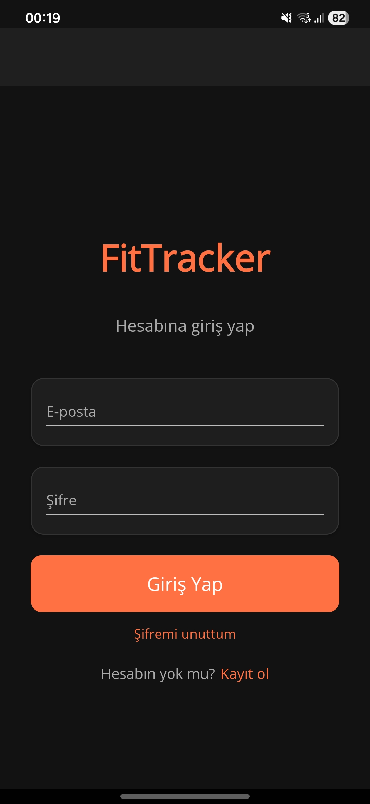
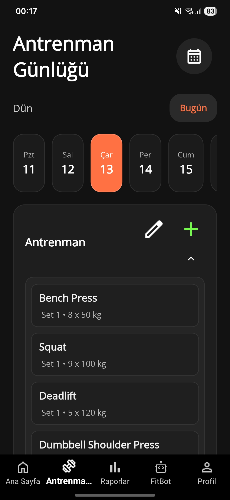
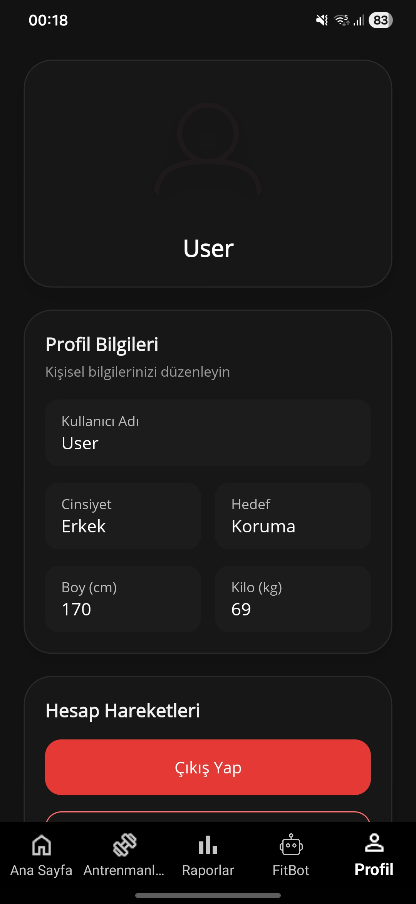
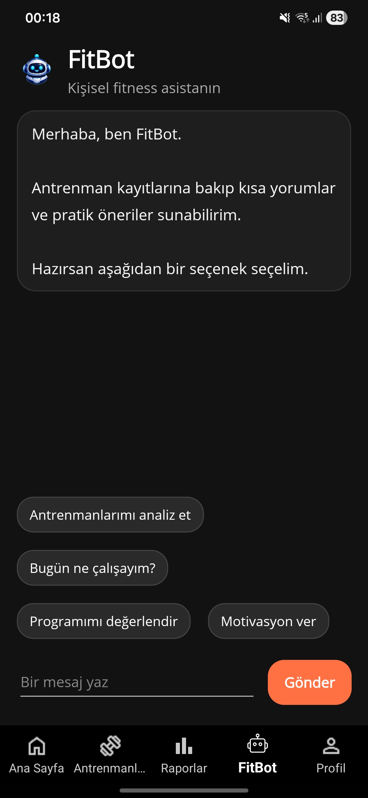
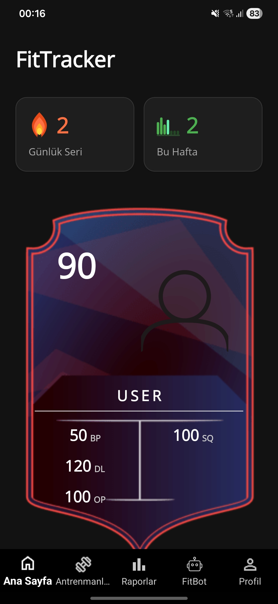

<h1 align="center">
  <br>
  🏋️ FitTracker
  <br>
</h1>

<p align="center">
  <strong>Antrenmanlarını takip et, gelişimini gör, hedeflerine ulaş.</strong>
</p>

<p align="center">
  
  
  
  
</p>

<p align="center">
  
  
  
  
</p>

---

## 📱 Uygulama Hakkında

**FitTracker**, spor antrenmanlarını dijital ortamda takip etmek için geliştirilmiş çok platformlu bir mobil uygulamadır. .NET MAUI ile yazılmış istemci ve ASP.NET Core ile yazılmış RESTful API'den oluşur. Kullanıcılar antrenman oluşturabilir, egzersizlerini kaydedebilir, zaman içindeki gelişimlerini grafiklerle izleyebilir ve yapay zeka destekli fitness asistanı **FitBot** ile sohbet edebilir.

---

## ✨ Özellikler

| Özellik | Açıklama |
|---|---|
| 🔐 **Kimlik Doğrulama** | JWT tabanlı kayıt, giriş ve şifre sıfırlama (e-posta kodu ile) |
| 🏃 **Antrenman Yönetimi** | Antrenman oluştur, düzenle, sil; egzersiz ve set ekle |
| 💪 **Egzersiz Kataloğu** | Hazır egzersiz kataloğundan seçim yapma |
| 📊 **İlerleme Takibi** | Haftalık/aylık grafiklerle gelişim analizi |
| 👤 **Profil** | Kullanıcı profili düzenleme (Türkçe karakter desteği dahil) |
| 🤖 **FitBot** | Groq (LLaMA 3.1) destekli yapay zeka fitness asistanı |
| 🎴 **FUT Kartı** | Kullanıcı istatistiklerini FIFA Ultimate Team tarzında gösteren kart |
| 📧 **Şifremi Unuttum** | 6 haneli e-posta doğrulama kodu ile 2 adımlı şifre sıfırlama |

---

## 🏗️ Proje Yapısı

```
FitTracker/
├── FitTracker.API/          # ASP.NET Core Web API (Backend)
│   ├── Controllers/         # Auth, Workout, Exercise, ExerciseSet...
│   ├── Models/              # Entity ve DTO modelleri
│   ├── Services/            # Email, PasswordReset, iş mantığı
│   ├── Data/                # EF Core DbContext'ler
│   └── Validators/          # FluentValidation kuralları
│
└── FitTrackr.MAUI/          # .NET MAUI (Frontend)
    ├── Pages/               # XAML sayfaları
    ├── ViewModels/          # MVVM ViewModel'ları
    ├── Services/            # HTTP istemci servisleri
    ├── Components/          # Yeniden kullanılabilir UI bileşenleri
    └── Resources/           # Font, ikon, splash screen
```

---

## 🛠️ Teknolojiler

### Backend — `FitTracker.API`
- **ASP.NET Core 9** — Web API
- **Entity Framework Core 9** — ORM, SQL Server
- **ASP.NET Identity** — Kullanıcı yönetimi
- **JWT Bearer Authentication** — Token tabanlı güvenlik
- **AutoMapper** — DTO dönüşümleri
- **FluentValidation** — Model doğrulama
- **Serilog** — Yapılandırılmış loglama
- **Swagger / OpenAPI** — API dokümantasyonu
- **System.Net.Mail (SMTP)** — E-posta gönderimi

### Frontend — `FitTrackr.MAUI`
- **.NET MAUI 9** — Cross-platform (Android, iOS, Windows, macOS)
- **CommunityToolkit.MVVM** — MVVM altyapısı, `ObservableObject`, `RelayCommand`
- **WeakReferenceMessenger** — Sayfalar arası mesajlaşma
- **JWT Decode** — Token'dan kullanıcı bilgisi okuma

### Altyapı
- **Azure App Service** — API deployment
- **Azure SQL** — Veritabanı
- **Groq API** (LLaMA 3.1 8B) — FitBot yapay zeka motoru

---

## 🚀 Kurulum ve Çalıştırma

### Gereksinimler

- [.NET 9 SDK](https://dotnet.microsoft.com/download/dotnet/9)
- [Visual Studio 2022+](https://visualstudio.microsoft.com/) (.NET MAUI ve ASP.NET Core iş yükleri)
- SQL Server (LocalDB veya Express yeterli)
- Android Emülatör veya fiziksel cihaz

---

### 1. Repoyu Klonla

```bash
git clone https://github.com/KULLANICI_ADIN/FitTracker.git
cd FitTracker
```

---

### 2. API Kurulumu

#### `appsettings.json` Yapılandırması

`FitTracker.API/appsettings.json` dosyasını aşağıdaki şablona göre doldur:

```json
{
  "ConnectionStrings": {
    "FitTrackrConnectionString": "Server=.;Database=FitTrackrDb;Trusted_Connection=True;TrustServerCertificate=True",
    "FitTrackrAuthConnectionString": "Server=.;Database=FitTrackrAuthDb;Trusted_Connection=True;TrustServerCertificate=True"
  },
  "Jwt": {
    "Key": "EN_AZ_32_KARAKTER_GUCLU_BIR_ANAHTAR",
    "Issuer": "https://localhost:7100/",
    "Audience": "https://localhost:7100/"
  },
  "Groq": {
    "ApiKey": "GROQ_API_KEY",
    "Model": "llama-3.1-8b-instant"
  },
  "Email": {
    "SmtpHost": "smtp.gmail.com",
    "SmtpPort": "587",
    "Username": "GMAIL_ADRESIN@gmail.com",
    "Password": "GMAIL_APP_PASSWORD",
    "FromAddress": "GMAIL_ADRESIN@gmail.com"
  }
}
```

> 💡 **Gmail App Password**: Google Hesabı → Güvenlik → 2 Adımlı Doğrulama açık olmalı → "App passwords" → 16 haneli şifre oluştur.

#### Veritabanını Oluştur

```bash
cd FitTracker.API

# Ana veritabanı
dotnet ef database update --context FitTrackrDbContext

# Auth veritabanı
dotnet ef database update --context FitTrackrAuthDbContext
```

#### API'yi Başlat

```bash
dotnet run
# veya Visual Studio'dan F5
```

Swagger arayüzü: `https://localhost:7100/swagger`

---

### 3. MAUI Uygulaması Kurulumu

`FitTrackr.MAUI/MauiProgram.cs` dosyasında API adresini ayarla:

```csharp
// Lokal geliştirme (Android emülatör için)
BaseAddress = new Uri("http://10.0.2.2:5187/")

// Production (Azure)
BaseAddress = new Uri("https://AZURE_APP_SERVICE_URL/")
```

Visual Studio'da hedef platformu seç (Android/Windows) → **F5** ile başlat.

---

## 🔒 Güvenlik Notları

> ⚠️ `appsettings.json` dosyasına gerçek şifre veya API anahtarı yazıp GitHub'a push **etme**.

Hassas bilgiler için önerilen yöntemler:
- **Lokal geliştirme**: [.NET User Secrets](https://learn.microsoft.com/en-us/aspnet/core/security/app-secrets) (`dotnet user-secrets set`)
- **Azure deployment**: Azure App Service → Configuration → Application Settings

```
Email__Username     →  senin@gmail.com
Email__Password     →  uygulama_sifresi
Groq__ApiKey        →  groq_api_key
Jwt__Key            →  jwt_gizli_anahtari
```

---

## 📡 API Endpoint'leri

### Auth
| Method | Endpoint | Açıklama |
|--------|----------|----------|
| `POST` | `/api/auth/register` | Kayıt |
| `POST` | `/api/auth/login` | Giriş (JWT döner) |
| `GET` | `/api/auth/profile` | Profil bilgisi |
| `PUT` | `/api/auth/profile` | Profil güncelle |
| `POST` | `/api/auth/forgot-password` | Şifre sıfırlama kodu gönder |
| `POST` | `/api/auth/reset-password` | Kodu doğrula, şifreyi sıfırla |

### Workout
| Method | Endpoint | Açıklama |
|--------|----------|----------|
| `GET` | `/api/workout` | Tüm antrenmanlar |
| `POST` | `/api/workout` | Yeni antrenman oluştur |
| `GET` | `/api/workout/{id}` | Antrenman detayı |
| `DELETE` | `/api/workout/{id}` | Antrenman sil |

### Exercise & Sets
| Method | Endpoint | Açıklama |
|--------|----------|----------|
| `POST` | `/api/exercise` | Antrenman'a egzersiz ekle |
| `DELETE` | `/api/exercise/{id}` | Egzersiz sil |
| `POST` | `/api/exerciseset` | Set ekle |
| `PUT` | `/api/exerciseset/{id}` | Set güncelle |
| `DELETE` | `/api/exerciseset/{id}` | Set sil |

---

## 🗂️ Mimari

```
┌──────────────────────────────────┐
│         .NET MAUI App            │
│  (Android / iOS / Windows / Mac) │
│                                  │
│   Pages ──► ViewModels           │
│                 │                │
│             Services             │
│          (HTTP + JWT)            │
└──────────────┬───────────────────┘
               │ HTTPS
               ▼
┌──────────────────────────────────┐
│      ASP.NET Core Web API        │
│        (Azure App Service)       │
│                                  │
│   Controllers ──► Services       │
│                       │          │
│                 EF Core ORM      │
└──────────────┬───────────────────┘
               │
               ▼
┌──────────────────────────────────┐
│          Azure SQL Server        │
│  FitTrackrDb + FitTrackrAuthDb   │
└──────────────────────────────────┘
```

---

## 📸 Ekran Görüntüleri

<p align="center">
  
  
  
</p>

<p align="center">
  
  
  
</p>

---

## 🤝 Katkıda Bulunma

1. Bu repoyu fork'la
2. Feature branch oluştur: `git checkout -b feature/yeni-ozellik`
3. Değişikliklerini commit et: `git commit -m 'feat: yeni özellik eklendi'`
4. Branch'i push'la: `git push origin feature/yeni-ozellik`
5. Pull Request aç

---

## 📄 Lisans

Bu proje [MIT Lisansı](LICENSE) ile lisanslanmıştır.

---

<p align="center">
  <sub>⚡ .NET MAUI + ASP.NET Core ile geliştirildi</sub>
</p>
