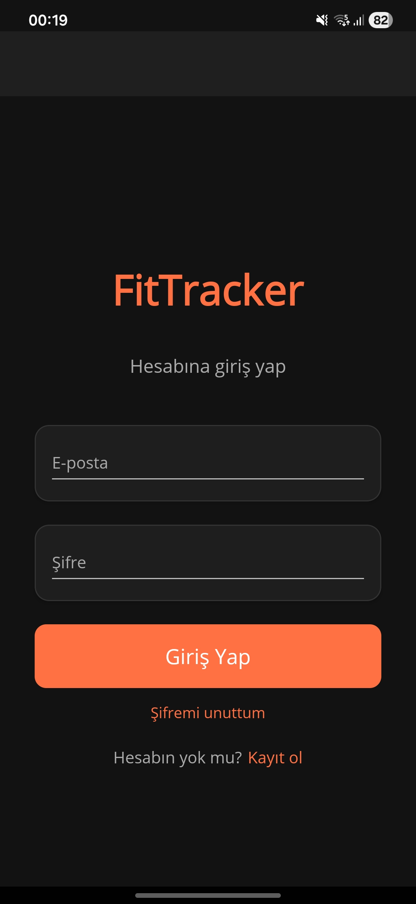
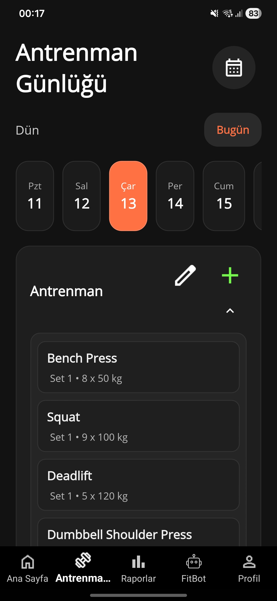
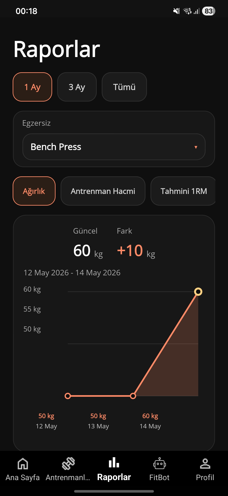
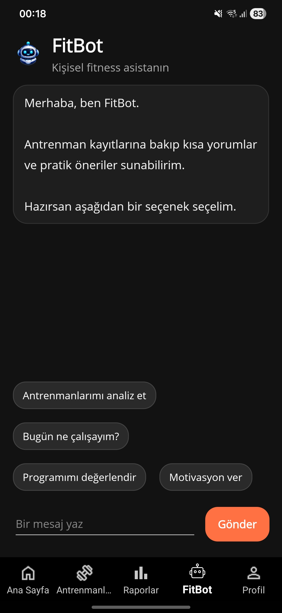

<h1 align="center">
  <br>
  FitTracker
  <br>
</h1>

<p align="center">
  <strong>Antrenmanlarını takip et, yapay zeka koçun FitBot ile gelişimini yönet.</strong>
</p>

<p align="center">
  <a href="https://play.google.com/store/apps/details?id=com.companyname.fittrackr.maui">
    
  </a>
</p>

<p align="center">
  
  
  
  
  
</p>

---

## 📱 FitTracker Nedir?

FitTracker, ağırlık antrenmanlarınızı takip eden **ve** yapay zeka destekli kişisel koç **FitBot** ile size özel program, motivasyon ve ilerleme analizi sunan bir fitness uygulamasıdır. Çoğu antrenman uygulaması sadece kayıt tutar; FitTracker tuttuğunuz kayıtları gerçek zamanlı analiz edip size aktif koçluk yapar — antrenman geçmişinizi, ağırlık trendlerinizi ve platoya girdiğiniz hareketleri fark edip Türkçe veya İngilizce, anlaşılır önerilerle karşınıza çıkar.

Sistemin arkasındaki mimari ve değerlendirme sonuçları IDAP 2026'da sunulan bir akademik makalede detaylandırılmıştır (bkz. [Katkıda Bulunma / Referans](#-akademik-referans)).

**Şu an sadece Android'de, Google Play üzerinden yayında.**

---

## ✨ Özellikler

| Özellik | Açıklama |
|---|---|
| 🤖 **FitBot** | Groq (Llama 3.3 70B) destekli yapay zeka koç — analiz, günün programı, motivasyon ve serbest sohbet |
| 🛡️ **Güvenlik Guardrail'i** | FitBot'un önerdiği ağırlık artışları, önceki kayıtlara göre deterministik olarak %10 ile sınırlanır (ACSM progressive overload prensibi) |
| 🌍 **Çoklu Dil** | Türkçe ve İngilizce arasında uygulama içinden anlık geçiş, FitBot dahil |
| 🏃 **Antrenman Yönetimi** | Antrenman oluştur, düzenle, sil; egzersiz ve set ekle |
| 📊 **İlerleme Takibi** | Haftalık/aylık grafiklerle gelişim analizi |
| 🎴 **FUT Kartı** | Kullanıcı istatistiklerini FIFA Ultimate Team tarzında gösteren kişisel rekor kartı |
| 🔐 **Kimlik Doğrulama** | JWT tabanlı kayıt/giriş, Google ile giriş, e-posta koduyla şifre sıfırlama |

---

## 📸 Ekran Görüntüleri

<p align="center">
  
  
  
  
</p>

---

## 🛠️ Teknoloji

**Backend:** ASP.NET Core 9 · Entity Framework Core 9 · Azure SQL · ASP.NET Identity + JWT · Groq API (Llama 3.3 70B) · Azure App Service
**Mobil:** .NET MAUI 9 · CommunityToolkit.Mvvm · Google OAuth (PKCE)

Mimarinin detaylı diyagramı ve backend/mobil katman ayrımı için [Mimari](#mimari) bölümüne bakın.

---

<a id="mimari"></a>
<details>
<summary><strong>🏗️ Proje Yapısı ve Mimari</strong> (genişletmek için tıklayın)</summary>

```
FitTracker/
├── FitTracker.API/          # ASP.NET Core Web API (Backend)
│   ├── Controllers/         # Auth, Workout, Exercise, ExerciseSet...
│   ├── Models/               # Entity ve DTO modelleri
│   ├── Services/             # FitBot, guardrail, email, iş mantığı
│   ├── Data/                  # EF Core DbContext'ler
│   └── Validators/            # FluentValidation kuralları
│
└── FitTrackr.MAUI/          # .NET MAUI (Frontend)
    ├── Pages/                # XAML sayfaları
    ├── ViewModels/           # MVVM ViewModel'ları
    ├── Services/              # HTTP istemci servisleri
    ├── Localization/          # TR/EN resx tabanlı çoklu dil altyapısı
    └── Resources/             # Font, ikon, splash screen
```

```
┌──────────────────────────────────┐
│         .NET MAUI App            │
│             (Android)            │
│   Pages ──► ViewModels ──► HTTP  │
└──────────────┬───────────────────┘
               │ HTTPS + JWT
               ▼
┌──────────────────────────────────┐
│      ASP.NET Core Web API        │
│        (Azure App Service)       │
│  Controllers ──► Services         │
│         ├─ AiWorkoutCoachService  │
│         ├─ AcsmGuardrailService   │
│         └─ EF Core ORM            │
└──────────────┬───────────────────┘
               │
               ▼
┌──────────────────────────────────┐
│          Azure SQL Server        │
│  FitTrackrDb + FitTrackrAuthDb   │
└──────────────────────────────────┘
```

Canlı API dokümantasyonu için Swagger arayüzü (`/swagger`) kullanılır; endpoint listesi burada ayrıca tutulmuyor ki eskimesin.

</details>

<details>
<summary><strong>🚀 Geliştirici Kurulumu</strong> (genişletmek için tıklayın)</summary>

### Gereksinimler
- [.NET 9 SDK](https://dotnet.microsoft.com/download/dotnet/9)
- [Visual Studio 2022+](https://visualstudio.microsoft.com/) (.NET MAUI ve ASP.NET Core iş yükleri)
- SQL Server (LocalDB veya Express yeterli)
- Android Emülatör veya fiziksel cihaz

### 1. Repoyu Klonla
```bash
git clone https://github.com/mustafabilghn/FitTracker.git
cd FitTracker
```

### 2. API Yapılandırması

`FitTracker.API/appsettings.json` dosyasını doldur:

```json
{
  "ConnectionStrings": {
    "FitTrackrConnectionString": "Server=.;Database=FitTrackrDb;Trusted_Connection=True;TrustServerCertificate=True",
    "FitTrackrAuthConnectionString": "Server=.;Database=FitTrackrAuthDb;Trusted_Connection=True;TrustServerCertificate=True"
  },
  "Jwt": { "Key": "EN_AZ_32_KARAKTER_GUCLU_BIR_ANAHTAR", "Issuer": "https://localhost:7100/", "Audience": "https://localhost:7100/" },
  "Groq": { "ApiKey": "GROQ_API_KEY", "Model": "llama-3.3-70b-versatile" },
  "Email": { "SmtpHost": "smtp.gmail.com", "SmtpPort": "587", "Username": "GMAIL_ADRESIN@gmail.com", "Password": "GMAIL_APP_PASSWORD", "FromAddress": "GMAIL_ADRESIN@gmail.com" }
}
```

> ⚠️ Gerçek şifre/API anahtarını `appsettings.json`'a yazıp push **etme** — lokalde [.NET User Secrets](https://learn.microsoft.com/en-us/aspnet/core/security/app-secrets), Azure'da App Service → Configuration kullan.

```bash
cd FitTracker.API
dotnet ef database update --context FitTrackrDbContext
dotnet ef database update --context FitTrackrAuthDbContext
dotnet run   # Swagger: https://localhost:7100/swagger
```

### 3. MAUI Uygulaması

`FitTrackr.MAUI/MauiProgram.cs` içinde API adresini ayarla (lokal: `http://10.0.2.2:5187/`, prod: Azure URL'in), Visual Studio'da Android hedefini seçip **F5**.

</details>

---

## 🤝 Katkıda Bulunma

1. Fork'la → `git checkout -b feature/yeni-ozellik`
2. Commit et → `git push origin feature/yeni-ozellik`
3. Pull Request aç

## 📄 Akademik Referans

M. B. Ateş and H. Gümüşkaya, "FitTracker: Personalized Fitness Coaching with LLM Agent Integration," presented at IDAP 2026, Malatya–İstanbul, Türkiye.

## 📄 Lisans

[MIT Lisansı](LICENSE)

---

<p align="center">
  <sub>⚡ .NET MAUI + ASP.NET Core ile geliştirildi</sub>
</p>
